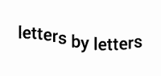
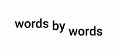
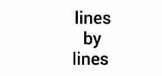
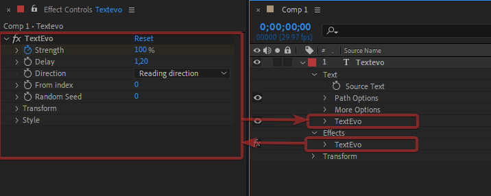

# Introduction

## What is Textevo ?

Textevo is a text animation tool for after effects. It is mainly useful to break down text animation letters by letters, words by words or lines by lines.

Textevo automatically adds a text animation group and a control effect:

The "strength" parameter is used to adjust the overall intensity of the effect. You will animate it to your liking and the instances (letters, words, lines) of the text will follow with the delay you have set.

You can add as many textvo effects on your text layer. You will be able to animate your texts with a lot of freedom, to add arrival and departure movements as well as intermediate animations. 

## What's new ?

- A light and flexible interface
- An effect grouping the main parameters 
- Ability to stack effects for more freedom
- More animation directions ( random , outwards , inwards etc... )
- A preset system

And lots of other little options

## About !

This script makes use of DuAEF - The Duduf After Effects Framework, by Nicolas Dufresne and Contributors licensed under the GNU General Public License v3. 
 
For more information: https://rainboxlab.org/ 
 
To support Nicolas Dufresne: https://www.patreon.com/duduf 

